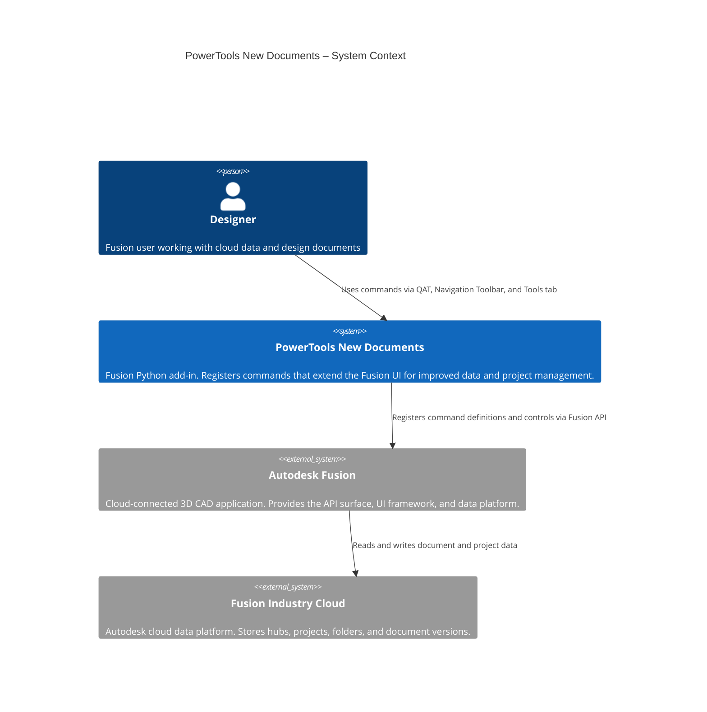

# PowerTools: New Documents for Fusion

PowerTools New Documents is a Fusion add-in that improves productivity when working with cloud data, team projects, and multi-document assemblies. It adds commands that surface actions that are otherwise buried in menus or difficult to discover.

## Commands

### Information tools

#### [Document Information](./docs/Document%20Information.md)

Displays cloud data identifiers and metadata for the active design document, including hub, project, folder, and document IDs, version history, and schema migration warnings. Useful for troubleshooting data management issues and sharing document references with collaborators.

#### [Document History](./docs/Document%20History.md)

Adds a **History** button to the Quick Access Toolbar that opens the active document's history panel directly, without requiring a right-click on the browser root.

---

### Project tools

#### [Add Default Project Folders](./docs/Default%20Folders.md)

Creates a predefined set of folders in the root of the active Fusion project. Skips any folders that already exist so the command is safe to run on existing projects. Supports two configurable folder sets.

---

### UI tools

#### [Toggle Data Pane](./docs/Toggle%20Data%20Pane.md)

Adds a button to the Navigation Toolbar that opens or closes the Data Pane with a single click. Automatically detects the current pane state and takes the correct action.

#### [Recovery Save](./docs/Recovery%20Save.md)

Adds a **Recovery Save** entry to the QAT File dropdown that writes a local recovery checkpoint for the active document without creating a new cloud version or notifying collaborators.

---

### Automation

#### [Show In Location](./docs/Show%20In%20Location.md)

Automatically runs Fusion's built-in Show In Location command whenever a design document is opened or you switch document tabs, keeping the Data Panel synchronized with the active document at all times. Requires no user interaction.

---

## Architecture

PowerTools New Documents is structured as a standard Fusion Python add-in. Each command is an independent module under the `commands/` directory that exposes `start()` and `stop()` functions. The top-level `commands/__init__.py` collects all command modules into a list and delegates lifecycle calls to them.

### Module structure

| Module | Command | UI location |
|---|---|---|
| `commands/autosave/` | Recovery Save | QAT → File dropdown |
| `commands/datatoggle/` | Toggle Data Pane | Navigation Toolbar |
| `commands/defaultfolders/` | Add Default Project Folders | QAT → File dropdown |
| `commands/dochistory/` | Document History | QAT |
| `commands/docinfo/` | Document Information | Design workspace → Tools tab → Power Tools panel |
| `commands/docopen/` | Show In Location | Automatic – no UI control |

---

IMA LLC Copyright
