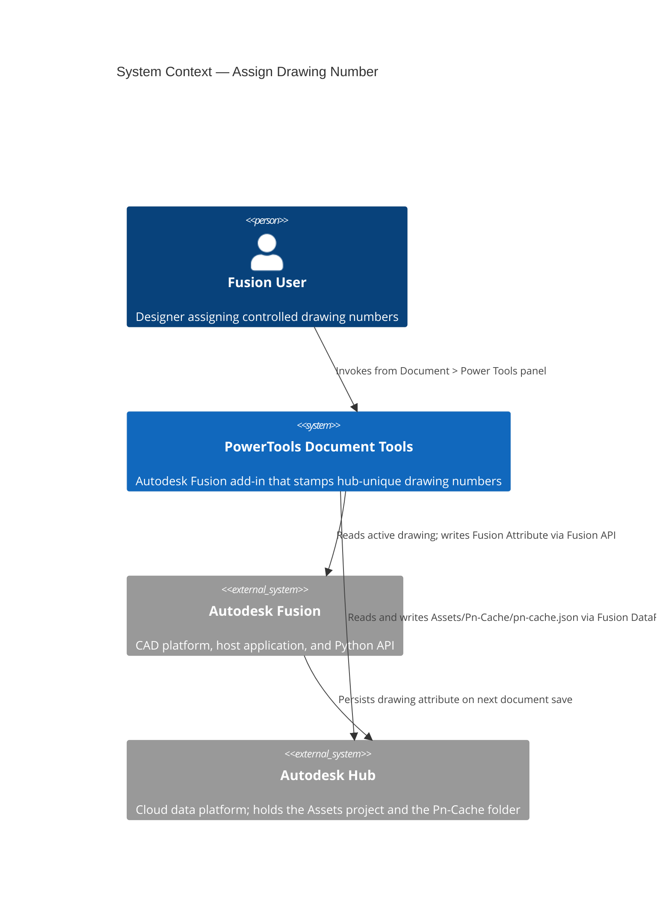
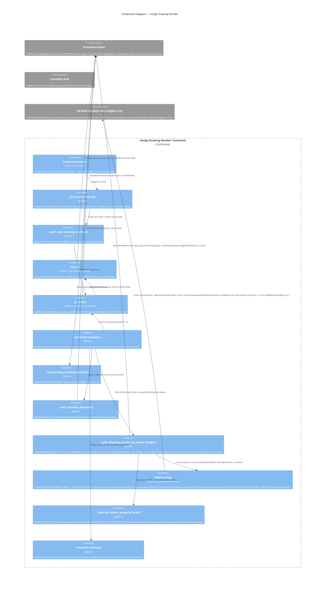
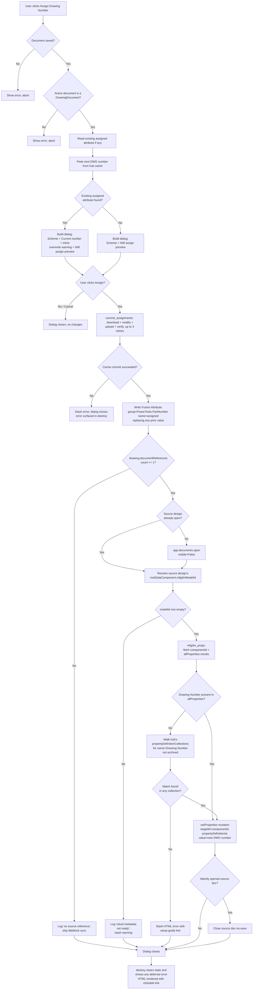

# Assign Drawing Number

[Back to README](../README.md)

## Overview

The **Assign Drawing Number** command reserves the next sequential `DWG-NNNNNN` number from the hub-wide Pn-Cache and stamps it on the active Autodesk Fusion 2D drawing document. The number is persisted two ways, both automatic:

1. **Drawing document attribute** — the canonical local record. Because `adsk.drawing` does not expose a first-class `partNumber` property for drawings, the number is stored as an `adsk.core.Attribute` on the `DrawingDocument` (group `PowerTools.PartNumber`, name `assigned`).

2. **Source design's `Drawing Number` custom property** — the titleblock hook. The command navigates the drawing's single `DocumentReference` to the source 3D design (opening it silently in the background if it isn't already in memory), then writes the assigned number through the MFGDM GraphQL `setProperties` mutation into the source root component's `Drawing Number` custom property. A titleblock with a binding to that custom property auto-populates the next time the drawing regenerates — no manual titleblock edits needed.

This command shares the same hub cache (`Assets / Pn-Cache / pn-cache.json`) used by [Assign Part Numbers](./Assign%20Part%20Numbers.md), so drawing numbers and 3D part numbers never collide and every assigned number is unique across the hub.

> **Note:** This command is available only in the Autodesk Fusion Drawing workspace. The 3D design equivalent is [Assign Part Numbers](./Assign%20Part%20Numbers.md).

## Capabilities

| Capability | Details |
|---|---|
| Hub-unique drawing numbers | Single `DWG` scheme shared across the active hub; counter lives alongside the 3D part number counters |
| Durable drawing-side stamp | Assigned number stored as an `adsk.core.Attribute` on the DrawingDocument, group `PowerTools.PartNumber`, name `assigned` |
| Automatic titleblock sync | After the drawing stamp, the command writes the same number into the source design's root component `Drawing Number` custom property via the MFGDM GraphQL `setProperties` mutation. Titleblocks bound to that property auto-populate on next regenerate |
| Silent source-design open | When the source design is not already loaded in Fusion, the command opens it invisibly (`visible=False`), performs the property write, and closes it again — no extra document tab appears |
| Single-reference rule | Fusion drawings reference at most one 3D design; the command uses `documentReferences[0]` and is a no-op if the drawing has no source reference |
| Setup-guide error | If the source design lacks the `Drawing Number` custom property, the command surfaces a rich error message with a clickable link to the setup guide (URL configurable via `DRAWING_NUMBER_SETUP_URL`) |
| Optimistic retry | Cache commit uses download → modify → upload → verify with up to 3 retries to handle concurrent writers |
| Live preview | Dialog shows the actual next `DWG-NNNNNN` by reading the hub cache when the dialog opens |
| Inline overwrite notice | When the drawing already has a number, the dialog shows the current value and an inline warning note. No extra modal confirmation — clicking Assign replaces the existing number |

## Prerequisites

- The active document must be a saved Autodesk Fusion 2D drawing.
- The active hub must contain a project named **Assets** (project creation is deliberately not automated — it usually requires admin permissions).
- The user must have write permission on the **Assets** project.
- The hub's Custom Properties collection should include a property named **Drawing Number** (exact case) linked to the source design's applicable entity type. Without it, the drawing-side stamp still succeeds but the titleblock sync is skipped with a linked setup guide.

## Notes

- The **Pn-Cache** folder under **Assets** is auto-created on first use.
- `pn-cache.json` is auto-created on first commit.
- Document save after assignment is intentionally left to the user so the command dialog closes promptly on **Assign**. The titleblock sync writes to the cloud MFGDM record directly and does not require a local save of the source design.
- Drawing numbers never roll over or recycle — numbering is monotonic across the hub.
- The source design is opened invisibly during sync if it isn't already loaded. The user sees no extra document tab and the source design is closed automatically after the write completes.

## Access

The **Assign Drawing Number** command is located on the **Document** tab, in the **Power Tools** panel of the Autodesk Fusion Drawing workspace.

1. Open a saved Fusion drawing.
2. On the **Document** tab, in the **Power Tools** panel, select **Assign Drawing Number**.

## How to use

1. Open the drawing you want to number.
2. Run **Assign Drawing Number** from the **Power Tools** panel.
3. The dialog shows:
   - **Scheme** — the fixed `DWG — Drawing (controlled document)` label.
   - **Current number** — the drawing's existing assigned number. This row appears only when a prior number exists on the drawing.
   - **Warning note** — an inline yellow warning, shown only when a prior number exists, explaining that clicking **Assign** will replace it with the preview below.
   - **Will assign** — the real next `DWG-NNNNNN` read from the hub cache.
4. Click **Assign**. Three things happen atomically from the user's perspective:
   - The cache counter is bumped via the optimistic-retry commit.
   - The new number is written as a Fusion Attribute on the drawing document.
   - The same number is synced into the source design's root component `Drawing Number` custom property (opening the source design silently if needed). The dialog closes as soon as these steps finish.
5. If the source design is missing the `Drawing Number` custom property, a post-close warning dialog appears with a clickable link to the setup guide. The drawing-side stamp is still correct — only the titleblock auto-sync was skipped.
6. To back out without changing anything, click **Cancel**.

## Output

- A Fusion Attribute named `assigned` is written to the DrawingDocument under group `PowerTools.PartNumber`. The value is the formatted number, e.g., `DWG-000042`.
- The source design's root component `Drawing Number` custom property is set to the same value via the MFGDM GraphQL `setProperties` mutation. This is the field the titleblock binds to.
- `Assets / Pn-Cache / pn-cache.json` is updated with the new `DWG.lastUsed` counter.

## Limitations

- The **Assets** project must exist; if absent, the command aborts with a clear error message.
- Titleblock auto-population depends on the hub's Custom Properties collection defining a `Drawing Number` property and the titleblock being bound to that property. If the property is missing from the hub, the command surfaces a setup-guide error after the drawing-side stamp completes — the drawing is still correctly numbered locally.
- `DataFile.description` is read-only in the current Fusion Python API, so the number is not mirrored to the Fusion Team web UI's description field.
- Numbers are not recycled when drawings are deleted.
- After more than 3 consecutive lost-race retries against the hub cache, the command aborts cleanly with an error and no attribute is written.
- Drawings with no `documentReferences` entry (e.g., drawings authored From Scratch) skip the titleblock sync with a log entry; the drawing-side stamp still succeeds.

---

## Architecture

### Command ID

`PTND-assignDrawingNumber`

### System context

The following diagram shows the relationship between the user, the Assign Drawing Number command, Autodesk Fusion, and the Autodesk Hub.

### Component diagram

The following diagram shows how the internal components interact during a command invocation.

### Execution flow

The following diagram shows the step-by-step flow when the user runs the command.

### Storage

The assigned drawing number is written to two locations on successful Assign:

**On the drawing document itself** (canonical local record):

| Location | Value |
|---|---|
| `DrawingDocument.attributes` | — |
| &nbsp;&nbsp;group | `PowerTools.PartNumber` |
| &nbsp;&nbsp;name | `assigned` |
| &nbsp;&nbsp;value | formatted number, e.g., `DWG-000042` |

**On the source design's root component** (titleblock hook):

| Location | Value |
|---|---|
| MFGDM GraphQL — `Component.customProperties` on the root `mfgdmModelId` | — |
| &nbsp;&nbsp;propertyDefinition.name | `Drawing Number` (configurable via `DRAWING_NUMBER_PROPERTY_NAME`) |
| &nbsp;&nbsp;value | same formatted number, e.g., `DWG-000042` |

Both writes persist independently: the drawing-side attribute survives even if the titleblock sync fails, so the drawing is still correctly numbered locally.

### MFGDM GraphQL titleblock sync

The custom-property write goes through the MFGDM v3 GraphQL endpoint. Key facts the implementation depends on:

- Custom properties are **not** exposed through `Component.propertyGroups` on the Fusion Desktop Python API — that surface only covers the built-in `General` group (Part Name, Part Number, Description).
- `setProperties` is callable from the Fusion Desktop API despite Autodesk's own documentation suggesting it is blocked. The mutation succeeds when the target component's `isWritableByUser` is `True` and the property's `definition.isReadOnly` is `False` — both true for a user's own hub-configured Custom Properties collection.
- `SetPropertiesInput.targetId` must be the **`Component.id`** (time-specific, obtained via `model(modelId).component.id`). Using the timeless `mfgdmModelId` returns `"The targetId is not a valid Component or Drawing ID."`
- `SetPropertiesInput.propertyInputs` is a list of `{ propertyDefinitionId, value }`. The implementation never hard-codes a definition id — it's resolved dynamically via a two-tier lookup (below).

#### Two-tier property-definition lookup

The helper `set_component_custom_property()` resolves the property definition id through two queries in sequence:

1. **Fast path — `Component.allProperties`.** Reads the component's current property snapshot. This surfaces the definition id quickly when the property already has a value on this component, or when it is a base property (Part Name, Part Number, Description, etc.).

2. **Fallback — `Hub.propertyDefinitionCollections`.** When the fast path misses, the helper walks the hub's property-definition collections looking for a non-archived definition whose `name` matches. This is required because MFGDM's `Component.allProperties` and `Component.customProperties` only include properties that have a value set on the specific component — a defined-but-unset custom property (typical on the first-ever write to a new design) is filtered out and would otherwise look "missing." Walking the hub's collections surfaces the definition regardless of whether it has ever been assigned a value.

Only when **both** lookups fail does the helper raise `PropertyNotFoundError`, which triggers the setup-guide error dialog in the drawing command.

The plumbing lives in `commands/partnumber_shared/mfgdm_props.py`:

| Symbol | Role |
|---|---|
| `MFGDM_URL` | `"mfgdm://v3"` — Fusion-internal URL scheme that transparently attaches user auth |
| `MfgdmPropsError` | Base exception for HTTP, GraphQL, or auth failures |
| `PropertyNotFoundError` | Raised when the named property is not defined anywhere in the hub's property-definition collections. Callers treat this distinctly to trigger the setup-guide error dialog |
| `_find_definition_in_hub(hub_id, name)` | Private helper — walks `Hub.propertyDefinitionCollections.results[].definitions.results[]` and returns the first non-archived match |
| `set_component_custom_property(model_id, property_name, value)` | Public one-shot helper: fetches componentId, runs the two-tier definition lookup, runs the `setProperties` mutation, returns the echoed value |

The drawing command's `_sync_drawing_number_to_source_design()` orchestrates the workflow above (navigate `documentReferences[0]` → silently open source design if needed → call `set_component_custom_property` → close source design if we opened it).

### Shared infrastructure

This command shares the hub cache infrastructure with [Assign Part Numbers](./Assign%20Part%20Numbers.md). See that document for:

- The **Pn-Cache JSON** shape and location.
- The **concurrency** model (optimistic retry + upload verification).
- Details of the `partnumber_shared.hub_fs`, `partnumber_shared.pn_cache`, and `partnumber_shared.schemes` modules.

The `partnumber_shared.mfgdm_props` module introduced for this command is also available for reuse by any future command that needs to read or write custom properties via MFGDM GraphQL.

---

[Back to README](../README.md)

---

*Copyright © 2026 IMA LLC. All rights reserved.*
