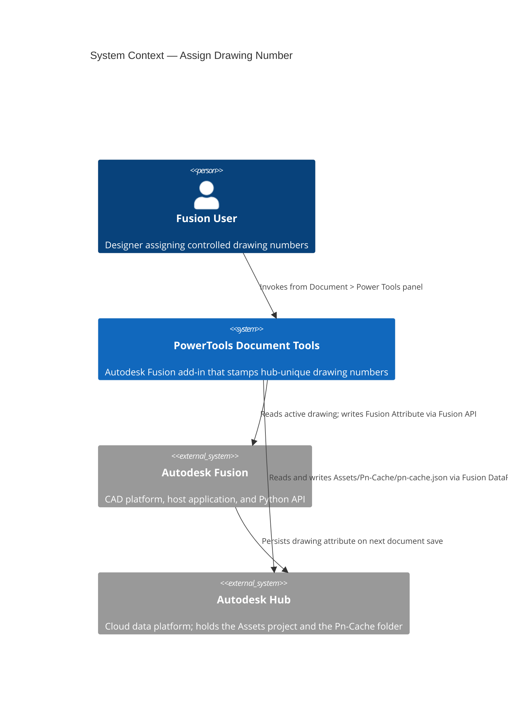
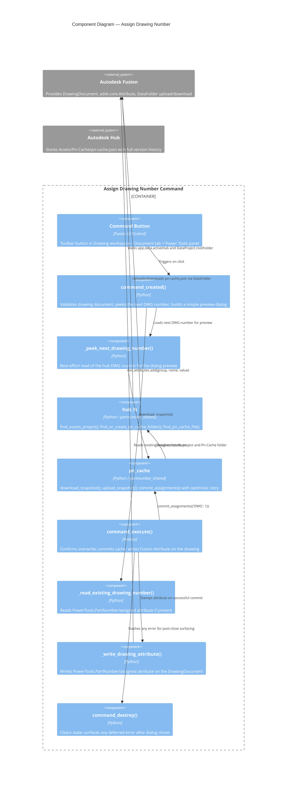

# Assign Drawing Number

[Back to README](../README.md)

## Overview

The **Assign Drawing Number** command reserves the next sequential `DWG-NNNNNN` number from the hub-wide Pn-Cache and stamps it on the active Autodesk Fusion 2D drawing document. Because the Fusion Python API does not expose a first-class `partNumber` property for drawings, the assigned number is stored as a Fusion Attribute on the drawing document and is later retrievable by follow-up commands — for example, a titleblock-stamp command.

This command shares the same hub cache (`Assets / Pn-Cache / pn-cache.json`) used by [Assign Part Numbers](./Assign%20Part%20Numbers.md), so drawing numbers and 3D part numbers never collide and every assigned number is unique across the hub.

> **Note:** This command is available only in the Autodesk Fusion Drawing workspace. The 3D design equivalent is [Assign Part Numbers](./Assign%20Part%20Numbers.md).

## Capabilities

| Capability | Details |
|---|---|
| Hub-unique drawing numbers | Single `DWG` scheme shared across the active hub; counter lives alongside the 3D part number counters |
| Durable stamp | Assigned number stored as an `adsk.core.Attribute` on the DrawingDocument, group `PowerTools.PartNumber`, name `assigned` |
| Optimistic retry | Cache commit uses download → modify → upload → verify with up to 3 retries to handle concurrent writers |
| Live preview | Dialog shows the actual next `DWG-NNNNNN` by reading the hub cache when the dialog opens |
| Inline overwrite notice | When the drawing already has a number, the dialog shows the current value and an inline warning note. No extra modal confirmation — clicking Assign replaces the existing number |
| Titleblock integration hook | The attribute storage is the target for a future command that writes the number into the drawing titleblock |

## Prerequisites

- The active document must be a saved Autodesk Fusion 2D drawing.
- The active hub must contain a project named **Assets** (project creation is deliberately not automated — it usually requires admin permissions).
- The user must have write permission on the **Assets** project.

## Notes

- The **Pn-Cache** folder under **Assets** is auto-created on first use.
- `pn-cache.json` is auto-created on first commit.
- Document save after assignment is intentionally left to the user so the command dialog closes promptly on **Assign**.
- Drawing numbers never roll over or recycle — numbering is monotonic across the hub.

## Access

The **Assign Drawing Number** command is located on the **Document** tab, in the **Power Tools** panel of the Autodesk Fusion Drawing workspace.

1. Open a saved Fusion drawing.
2. On the **Document** tab, in the **Power Tools** panel, select **Assign Drawing Number**.

## How to use

1. Open the drawing you want to number.
2. Run **Assign Drawing Number** from the **Power Tools** panel.
3. The dialog shows:
   - **Scheme** — the fixed `DWG — Drawing (controlled document)` label.
   - **Current number** — the drawing's existing assigned number. This row appears only when a prior number exists on the drawing.
   - **Warning note** — an inline yellow warning, shown only when a prior number exists, explaining that clicking **Assign** will replace it with the preview below.
   - **Will assign** — the real next `DWG-NNNNNN` read from the hub cache.
4. Click **Assign**. The cache counter is bumped atomically and the new number is written as a Fusion Attribute on the drawing document; the dialog closes. If the drawing had a prior number, it is replaced — no additional modal confirmation is shown.
5. To back out without changing anything, click **Cancel**.

## Output

- A Fusion Attribute named `assigned` is written to the DrawingDocument under group `PowerTools.PartNumber`. The value is the formatted number, e.g., `DWG-000042`.
- `Assets / Pn-Cache / pn-cache.json` is updated with the new `DWG.lastUsed` counter.

## Limitations

- The **Assets** project must exist; if absent, the command aborts with a clear error message.
- The assigned number is not automatically written to the drawing titleblock. A follow-up command is planned to read the Fusion Attribute and stamp it into the titleblock.
- `DataFile.description` is read-only in the current Fusion Python API, so the number is not mirrored to the Fusion Team web UI's description field.
- Numbers are not recycled when drawings are deleted.
- After more than 3 consecutive lost-race retries against the hub cache, the command aborts cleanly with an error and no attribute is written.

---

## Architecture

### Command ID

`PTND-assignDrawingNumber`

### System context

The following diagram shows the relationship between the user, the Assign Drawing Number command, Autodesk Fusion, and the Autodesk Hub.



### Component diagram

The following diagram shows how the internal components interact during a command invocation.



### Execution flow

The following diagram shows the step-by-step flow when the user runs the command.

```mermaid
flowchart TD
    A[User clicks Assign Drawing Number] --> B{Document saved?}
    B -- No --> B1[Show error; abort]
    B -- Yes --> C{Active document is a DrawingDocument?}
    C -- No --> C1[Show error; abort]
    C -- Yes --> D[Read existing assigned attribute if any]
    D --> E[Peek next DWG number from hub cache]
    E --> F{Existing assigned\nattribute found?}
    F -- Yes --> F1[Build dialog:\nScheme + Current number + inline\noverwrite warning + Will assign preview]
    F -- No --> F2[Build dialog:\nScheme + Will assign preview]
    F1 --> G{User clicks Assign?}
    F2 --> G
    G -- No / Cancel --> G1[Dialog closes; no changes]
    G -- Yes --> I[commit_assignments: download + modify +\nupload + verify, up to 3 retries]
    I --> I1{Cache commit succeeded?}
    I1 -- No --> I2[Stash error; dialog closes;\nerror surfaced in destroy]
    I1 -- Yes --> J[Write Fusion Attribute:\ngroup=PowerTools.PartNumber name=assigned\n(replacing any prior value)]
    J --> K[Dialog closes]
    K --> L[destroy clears state and\nshows any deferred error]
```

### Storage

The assigned drawing number is stored as a single Fusion Attribute on the DrawingDocument:

| Location | Value |
|---|---|
| `DrawingDocument.attributes` | — |
| &nbsp;&nbsp;group | `PowerTools.PartNumber` |
| &nbsp;&nbsp;name | `assigned` |
| &nbsp;&nbsp;value | formatted number, e.g., `DWG-000042` |

The attribute is durable across saves and survives version history. A follow-up titleblock command will read this attribute to stamp the number into the drawing's titleblock.

### Shared infrastructure

This command shares the hub cache infrastructure with [Assign Part Numbers](./Assign%20Part%20Numbers.md). See that document for:

- The **Pn-Cache JSON** shape and location.
- The **concurrency** model (optimistic retry + upload verification).
- Details of the `partnumber_shared.hub_fs`, `partnumber_shared.pn_cache`, and `partnumber_shared.schemes` modules.

---

[Back to README](../README.md)

---

*Copyright © 2026 IMA LLC. All rights reserved.*
