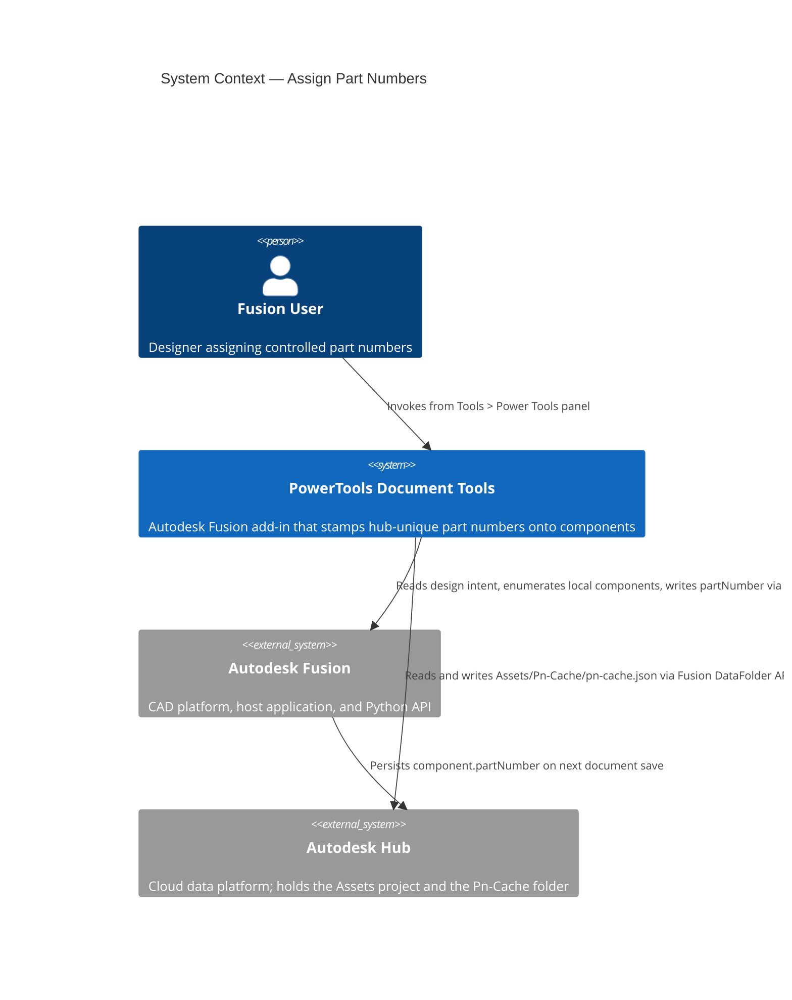
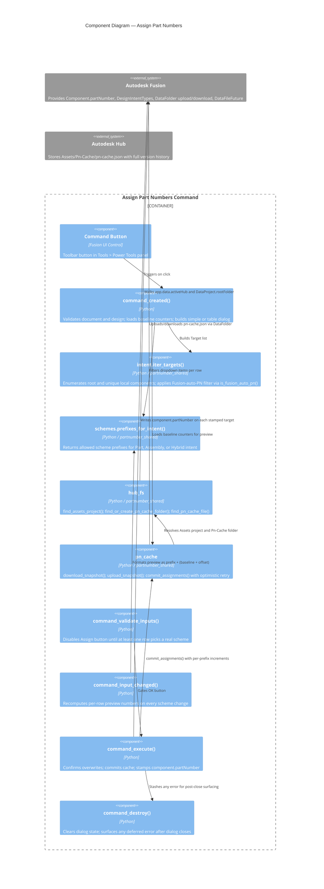
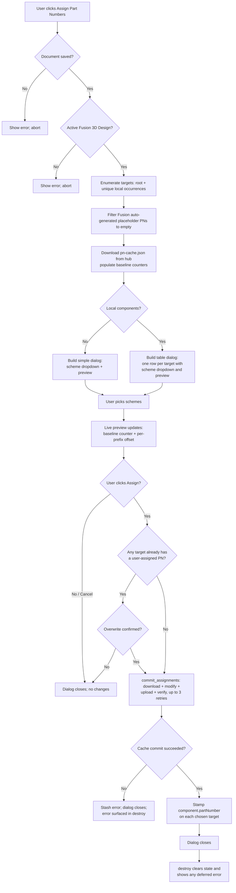
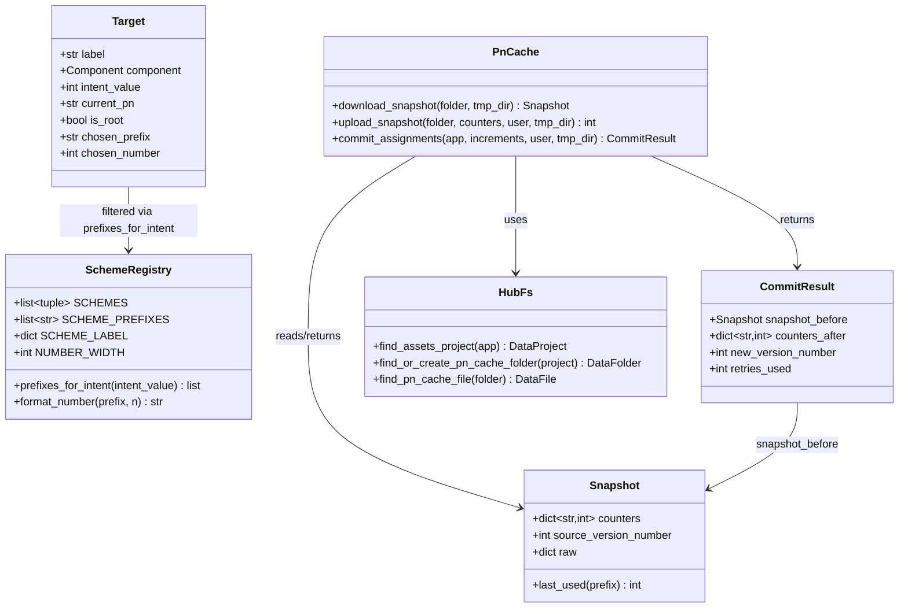

# Assign Part Numbers

[Back to README](../README.md)

## Overview

The **Assign Part Numbers** command stamps controlled, team-unique part numbers onto the active Autodesk Fusion 3D design. Numbers are drawn from hub-wide sequential schemes — `PRT`, `ASY`, `WLD`, `COT`, and `TOL` — whose counters are persisted in a shared JSON cache inside the active hub so multiple users never mint duplicate numbers.

When the active design has local components, the dialog presents a per-component table so each local can be assigned its own scheme and sequential number in a single atomic cache update. When the design has no local components, a single scheme dropdown appears instead. Scheme choices are filtered by the design's `DesignIntentTypes` so, for example, a Part Intent design can never be assigned an `ASY` number.

> **Note:** This command is available only in the Autodesk Fusion Design workspace. Drawings use the separate [Assign Drawing Number](./Assign%20Drawing%20Number.md) command, which shares the same hub cache.

## Capabilities

| Capability | Details |
|---|---|
| Intent-filtered schemes | Scheme dropdown lists only the prefixes allowed for the design's `DesignIntentTypes` (Part, Assembly, or Hybrid) |
| Per-local-component numbering | Table mode shows one row per local (non-referenced) occurrence plus the root component; each row picks its own scheme and receives its own sequential number |
| Hub-shared counters | Counters live in `Assets / Pn-Cache / pn-cache.json` so multiple users on the same hub get distinct numbers without coordination |
| Optimistic retry | Cache commit uses download → modify → upload → verify with up to 3 retries to handle concurrent writers |
| Auto-PN suppression | Fusion's auto-generated placeholder part numbers (`YYYY-MM-DD-HH-MM-SS-mmm`) are treated as no existing assignment and do not trigger the overwrite prompt |
| Live preview | Each row previews its next-in-scheme number as the user picks a scheme; numbers stay sequential across rows that share a prefix |
| Atomic commit | All rows in a single invocation bump the cache in one version, so the numbers assigned are contiguous and never interleave with another user's numbers |

## Schemes

| Prefix | Item class | Allowed for intent |
|---|---|---|
| `PRT` | Custom part (single piece, any process) | Part, Hybrid |
| `ASY` | Assembly (has a BOM; one or more children) | Assembly, Hybrid |
| `WLD` | Weldment (as-welded item treated as a single deliverable) | Assembly, Hybrid |
| `COT` | Commercial off-the-shelf (fasteners, bearings, vendor components) | Part, Hybrid |
| `TOL` | Tooling, fixture, or jig | All design intents |
| `DWG` | Drawing (controlled document) | Reserved for drawings — not available in this command |

Numbers are zero-padded to six digits: `PRT-000001`, `ASY-000042`, `TOL-000017`, etc.

## Prerequisites

- The active document must be a saved Autodesk Fusion 3D design.
- The active hub must contain a project named **Assets** (project creation is deliberately not automated — it usually requires admin permissions).
- The user must have write permission on the **Assets** project.

## Notes

- The **Pn-Cache** folder under **Assets** is auto-created on first use.
- `pn-cache.json` is auto-created on first commit and versioned thereafter by Fusion's normal file-versioning.
- Document save after assignment is intentionally left to the user so the command dialog closes promptly on **Assign**.
- Deleted documents do not release their numbers back to the pool — numbering is monotonic.

## Access

The **Assign Part Numbers** command is located on the **Tools** tab, in the **Power Tools** panel of the Autodesk Fusion Design workspace.

1. Open a saved Fusion 3D design.
2. On the **Tools** tab, in the **Power Tools** panel, select **Assign Part Numbers**.

## How to use

### Simple mode — no local components

1. Open a saved design that has no local occurrences.
2. Run **Assign Part Numbers**.
3. The dialog shows the design intent, the component name, a **Scheme** dropdown, and a read-only **Preview**.
4. Pick a scheme (e.g., `PRT — Custom part`). The preview updates to the real next number from the hub cache.
5. Click **Assign**. The cache counter is bumped; `rootComponent.partNumber` is set; the dialog closes.

### Table mode — design has local components

1. Open a saved design that contains at least one local (non-referenced) occurrence.
2. Run **Assign Part Numbers**.
3. The dialog shows:
   - The design intent (e.g., `Hybrid Intent`).
   - A **Components** group with a table. Row 1 is the root component, tagged `(root)`. Subsequent rows are each unique local component.
   - Each row has its own **Scheme** dropdown (defaulted to `(skip)`) and read-only **Preview**.
4. Pick schemes per row. The **Preview** column updates live so each row previews the actual number it will receive. Rows sharing a prefix advance sequentially (first `PRT` row previews the next number, second previews the one after, and so on).
5. Leave any row at `(skip)` to exclude it from the assignment.
6. The **Assign** button is disabled until at least one row picks a real scheme.
7. Click **Assign**. All chosen rows are committed to the hub cache in a single atomic update; `component.partNumber` is stamped on each chosen component; the dialog closes.

### Overwrite confirmation

If any target already has a user-assigned part number (not a Fusion auto-generated placeholder), clicking **Assign** opens a confirmation listing the targets and their current part numbers. **Yes** overwrites; **No** cancels with no changes to the cache or any component.

## Output

- `component.partNumber` is set to the formatted number (e.g., `PRT-000042`) on each chosen target.
- `Assets / Pn-Cache / pn-cache.json` is updated with the new `lastUsed` counter for each affected scheme. The file is versioned by Fusion; previous versions remain accessible in the Fusion Team web UI for audit.

## Limitations

- The **Assets** project must exist; if absent, the command aborts with a clear error message.
- Numbers are not recycled when documents or components are deleted.
- Part numbers for referenced (linked) components are **not** assigned by this command — those belong to the source design and must be assigned there.
- The preview number shown in the dialog reflects the cache state at the moment the dialog opened. If a teammate commits between dialog open and **Assign**, the optimistic-retry loop transparently picks a fresh baseline and the actual assigned number may differ from the preview.
- After more than 3 consecutive lost-race retries, the command aborts cleanly with an error and no component is stamped.
- Scheme counters are stored as six-digit numbers; a single scheme can hold up to 999,999 assignments.

---

## Architecture

### Command ID

`PTND-assignPartNumbers`

### System context

The following diagram shows the relationship between the user, the Assign Part Numbers command, Autodesk Fusion, and the Autodesk Hub.



### Component diagram

The following diagram shows how the internal components interact during a command invocation.



### Execution flow

The following diagram shows the step-by-step flow when the user runs the command.



### Data model

The following diagram shows the relationships between the core data structures used by the command and the shared `partnumber_shared` package.



### Pn-Cache JSON

The shared counter file at `Assets / Pn-Cache / pn-cache.json` has the following shape. All six schemes are always written back, missing counters default to zero.

```json
{
  "version": 1,
  "schemes": {
    "PRT": { "lastUsed": 42 },
    "ASY": { "lastUsed": 7 },
    "WLD": { "lastUsed": 0 },
    "COT": { "lastUsed": 15 },
    "TOL": { "lastUsed": 3 },
    "DWG": { "lastUsed": 9 }
  },
  "updatedAt": "2026-04-19T18:22:10Z",
  "updatedBy": "<user-id>"
}
```

### Concurrency

The cache commit flow is a read-modify-write with optimistic retry, gated so `component.partNumber` is only stamped after the hub cache upload has been verified:

1. Download the latest `pn-cache.json` and remember the baseline counters.
2. Compute the new counters in memory by adding the per-prefix increments.
3. Upload the new JSON (creates a new version of the DataFile).
4. Re-download and verify the live counters match what we just wrote.
5. If another user raced us (the live counters disagree with ours), retry from step 1.
6. Cap at three retries. On the fourth failure, abort without stamping any component.
7. Only after the cache is durable: set `component.partNumber` on each target.

This guarantees the cache and the component stamps never diverge: either the cache records the number and the component is stamped, or neither happens.

---

[Back to README](../README.md)

---

*Copyright © 2026 IMA LLC. All rights reserved.*
