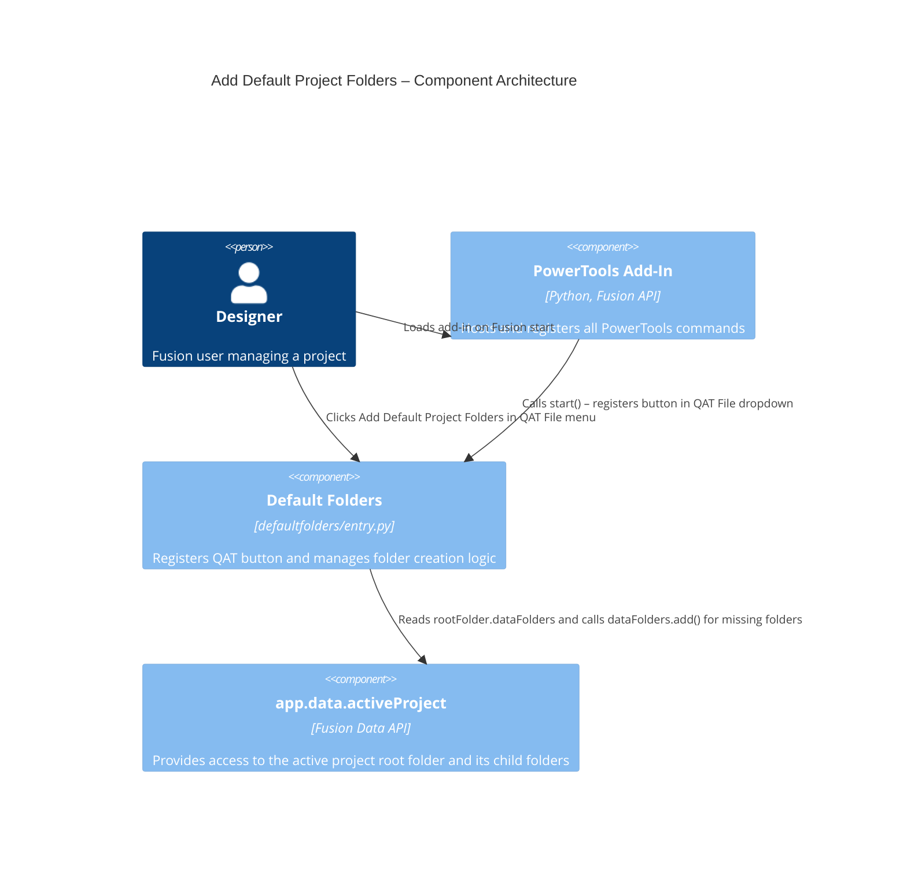

# Add Default Project Folders

[Back to README](../README.md)

## Overview

The **Add Default Project Folders** command creates a predefined set of folders in the root of the active Fusion project if those folders do not already exist. Running the command on a project that already has some or all of the default folders is safe—existing folders are detected by a case-insensitive name match and are not duplicated.

This command enforces a consistent folder structure across projects without requiring each team member to create folders manually.

## Capabilities

| Capability | Details |
|---|---|
| Create default project folders | Adds missing folders to the root of the active Fusion project |
| Skip existing folders | Detects existing folders by case-insensitive name comparison and skips them |
| Support two folder sets | Two predefined sets are available, selected by the `folderSet` variable in `entry.py` |
| Idempotent operation | Running the command multiple times on the same project produces no duplicate folders |

## Folder sets

### Set 1 (default)

| Folder name |
|---|
| Documents |
| Archive |
| Obit |

### Set 2

| Folder name |
|---|
| 00 - Products |
| 01 - Sub Assemblies |
| 02 - ECAD |
| 03 - Parts |
| 04 - Purchased Parts |
| 05 - 3DPCB Parts |
| 06 - Drawings |
| 07 - Documents |
| 08 - Render |
| 09 - Manufacture |
| 10 - Archive |
| XX - Obit |

To switch between sets, set the `folderSet` variable at the top of `commands/defaultfolders/entry.py` to `1` or `2`.

## Prerequisites

- A Fusion project must be active (a document does not need to be open).
- The add-in must have write access to the active project.

## Access

Select **Add Default Project Folders** from the **File** dropdown on the **Quick Access Toolbar (QAT)**.

## Architecture

The Add Default Project Folders command registers a button in the QAT File dropdown. On execute, it retrieves the root folder of the active project, reads all existing folder names into a lowercase list, and then iterates through the selected folder set, calling `dataFolders.add()` only for names that are not already present.

### Command ID

`PT-defaultfolders`

### Execution flow

1. The add-in registers the command definition and appends a button to the QAT File dropdown.
2. The user selects **Add Default Project Folders**.
3. The `command_execute` handler retrieves `app.data.activeProject.rootFolder.dataFolders`.
4. The handler builds a lowercase list of existing folder names for case-insensitive comparison.
5. Based on the `folderSet` value, the handler iterates through the corresponding folder name list.
6. For each folder name not found in the lowercase list, `dataFolders.add(name)` is called.

### Component diagram

---

[Back to README](../README.md)

*Copyright © 2026 IMA LLC. All rights reserved.*
