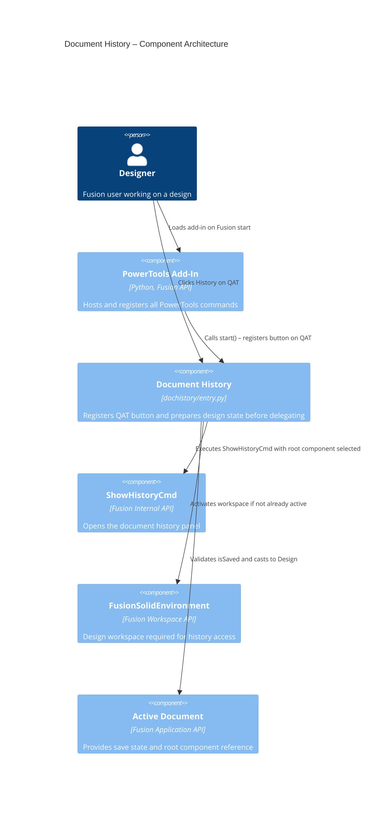

# Document History

[Back to Readme](../README.md)

## Overview

The **Document History** command adds a **History** button directly to the Fusion Quick Access Toolbar (QAT). Selecting it opens the timeline history panel for the active design document. Without this command, accessing document history requires right-clicking the root component in the browser panel—a non-obvious interaction that is easy to overlook. The QAT button makes history access immediate and consistent.

## Capabilities

| Capability | Details |
|---|---|
| Open document history | Displays the version and timeline history panel for the active design |
| Quick access from the QAT | History button is always present on the Quick Access Toolbar |
| Automatic workspace activation | Switches to the Design workspace if another workspace is active |
| Root component selection | Automatically selects the root component before opening history |

## Prerequisites

- A Fusion design document must be open.
- The active document must be saved to Fusion's cloud data (unsaved documents are not supported).

## Notes

- If the active document has not been saved, the command displays a message asking you to save first.
- If a non-Design workspace is active, the command automatically activates the Design workspace before opening history.

## Access

Select **History** from the **Quick Access Toolbar (QAT)**.

## Architecture

The Document History command registers a button directly on the QAT (not in the File dropdown). On execute, it validates that the active product is a Fusion Design and that the document is saved, switches to the Design workspace if needed, selects the root component, and then delegates to the built-in `ShowHistoryCmd`.

### Command ID

`PTND-history`

### Execution flow

1. The add-in registers the command definition with a custom icon and inserts a button before the **Save** control on the QAT.
2. The user clicks **History**.
3. The `command_execute` handler casts the active product to `adsk.fusion.Design`. If the cast fails, a message box is shown.
4. If the document is not saved, the handler prompts the user to save first.
5. If the active workspace is not `FusionSolidEnvironment`, the handler activates it and waits 250 ms.
6. The handler activates the root component, clears the active selection, adds the root component to the selection, and executes `ShowHistoryCmd`.

### Component diagram

---

[Back to Readme](../README.md)

IMA LLC Copyright