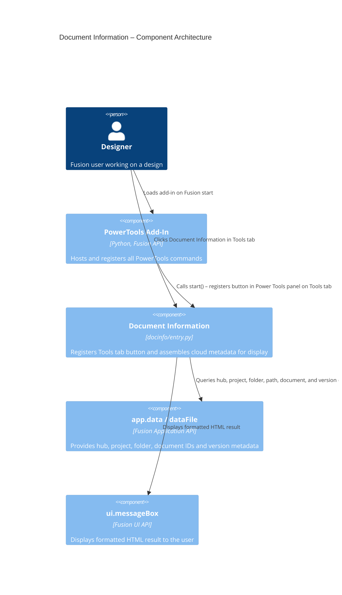

# Document Information

[Back to Readme](../README.md)

## Overview

The **Document Information** command displays a summary of cloud data identifiers and metadata for the active Fusion design document. It presents hub, project, folder, and document-level IDs alongside version details in a single dialog. This is particularly useful when troubleshooting data management issues, verifying project structure, or sharing document references with team members.

The command also detects whether the document was last saved by a different version of Fusion than the one currently running, and warns you that opening the document for edit will migrate it to the current schema—which may affect collaborators on older client versions.

## Capabilities

| Capability | Details |
|---|---|
| Display Team Hub information | Shows the hub name and Fusion Industry Cloud hub ID |
| Display Project information | Shows the project name and project ID |
| Display Folder information | Shows the parent folder name (or "Project Root") and folder ID |
| Display document path | Shows the full folder path to the document within the project |
| Display Document information | Shows the document name, document ID, and current version number |
| Display version details | Shows version number, total version count, version comment, and Fusion build number |
| Warn on schema migration | Alerts you when saving will migrate the document to the current Fusion build schema |

## Prerequisites

- A Fusion design document must be open and active.
- The document must be saved to Fusion's cloud data. Unsaved documents are not supported.

## Notes

- If the document was saved by a different Fusion build than the currently running client, the dialog title changes and a migration warning is appended to the output. Collaborators must be on the same client version to open the document after a schema migration.
- The document path is resolved by traversing the parent folder hierarchy up to the project root.

## Access

Select **Document Information** from the **Power Tools** panel on the **Tools** tab in a Fusion design document.

## Architecture

The Document Information command registers a button in a custom **Power Tools** panel on the **Tools** tab of the **Design** workspace. On execute, it queries the Fusion Application API for cloud data identifiers at the hub, project, folder, and document levels, resolves the full folder path, then presents all information in a formatted HTML message box.

### Command ID

`PTND-docinfo`

### Execution flow

1. The add-in registers the command definition and inserts a promoted button into the **Power Tools** panel under the **Tools** tab of the Design workspace. The tab and panel are created if they do not exist.
2. The user selects **Document Information**.
3. The `command_execute` handler verifies that the active document is saved using `futil.isSaved()`.
4. The handler queries hub, project, folder, and document metadata from `app.data` and `app.activeDocument.dataFile`.
5. The handler traverses `parentFolder` references iteratively to build the full document path.
6. Version numbers and Fusion build numbers are compared to detect schema migration risk.
7. The result is displayed as a formatted HTML string in a native Fusion message box.

### Component diagram

---

[Back to Readme](../README.md)

IMA LLC Copyright
