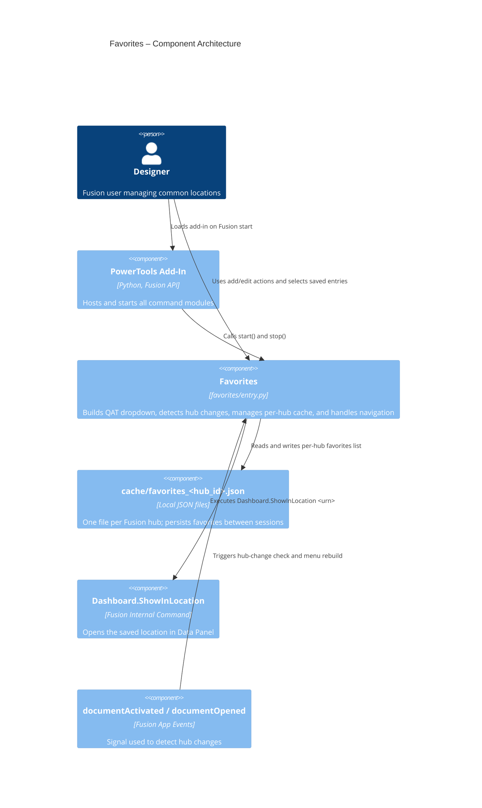

# Favorites

[Back to README](../README.md)

## Overview

The **Favorites** command adds a dropdown to the Fusion Quick Access Toolbar (QAT) so you can save and revisit frequently used document locations in Fusion Team Hub. It includes actions to add the current document location and edit the saved list.

Favorites are stored locally **per Fusion hub**. Each hub gets its own cache file named `cache/favorites_<hub_id>.json`. When you switch to a document from a different hub the dropdown automatically reloads and shows only the favorites that belong to that hub.

## Capabilities

| Capability | Details |
|---|---|
| Save active location | Adds the current saved document location using its `dataFile.id` URN |
| Quick navigation | Creates one-click menu items that run `Dashboard.ShowInLocation <urn>` |
| Duplicate prevention | Skips adding entries when the same URN is already saved for the active hub |
| Per-hub storage | Each Fusion hub has its own cache file (`cache/favorites_<hub_id>.json`) |
| Automatic hub switching | Detects hub changes on `documentActivated` / `documentOpened` and reloads the menu |
| Edit favorites | Opens an edit dialog where one or more favorites can be selected and deleted |
| Persistent cache | Restores the active hub's favorites on add-in startup |

## Prerequisites

- A Fusion document must be open.
- The document must be saved to Fusion cloud data.

## Notes

- Favorites are stored per hub in `cache/favorites_<hub_id>.json`.
- The hub ID is read from `app.data.activeHub.id` (e.g. `b.abc123`) and sanitised for use in a filename.
- The dropdown is automatically rebuilt whenever the active hub changes.
- Favorites are resolved and rebuilt into command entries each time the add-in starts.
- Saved entries use `dataFile.id` URNs, which is the same format that `Dashboard.ShowInLocation` expects.

## Access

Select **Favorites** from the **Quick Access Toolbar (QAT)**.

Inside the dropdown:

- **Favorite This Location** saves the active document location.
- **Edit Favorites** opens a dialog to remove selected entries.
- Each saved location appears as a command that navigates directly to that location in the Data Panel.

## Data model

Each hub's favorites are saved in a separate file: `cache/favorites_<sanitised_hub_id>.json`.

```json
{
  "hub_id": "b.abc123def456",
  "favorites": [
    {
      "name": "Document Name",
      "display": "Project > Folder > Subfolder",
      "urn": "urn:adsk.wipprod:dm.lineage:..."
    }
  ]
}
```

- `hub_id`: the Fusion hub ID this file belongs to (informational).
- `name`: document name shown in edit UI.
- `display`: folder lineage shown in the dropdown and edit table.
- `urn`: the `dataFile.id` URN used for reliable navigation.

## Architecture

The Favorites module creates one static dropdown control and a set of dynamic command definitions. The first two static actions are **Favorite This Location** and **Edit Favorites**. Below those actions, each favorite entry is added as a generated command that executes `Dashboard.ShowInLocation` for its saved URN.

### Command IDs

- Dropdown: `PTAT-favorites-dropdown`
- Add action: `PTAT-favorites-add`
- Edit action: `PTAT-favorites-edit`
- Dynamic favorite entries: `PTAT-fav-<index>`

### Execution flow

1. Add-in startup removes any legacy `cache/favorites.json`, resolves the active hub ID, and creates the Favorites dropdown on the QAT.
2. Startup registers static commands for add/edit and loads saved favorites from the active hub's cache file.
3. The menu is rebuilt with dynamic commands for each saved favorite.
4. Application-level `documentActivated` and `documentOpened` handlers monitor for hub changes. When the hub changes, the menu is rebuilt with the new hub's favorites.
5. **Favorite This Location** validates the active document is saved and writes a new favorite record to the active hub's cache file if it is not a duplicate.
6. **Edit Favorites** stages changes in a dialog table and commits deletes only when the user confirms.
7. Selecting any saved favorite executes `Dashboard.ShowInLocation <urn>`.

### Component diagram



---

[Back to README](../README.md)

*Copyright © 2026 IMA LLC. All rights reserved.*
