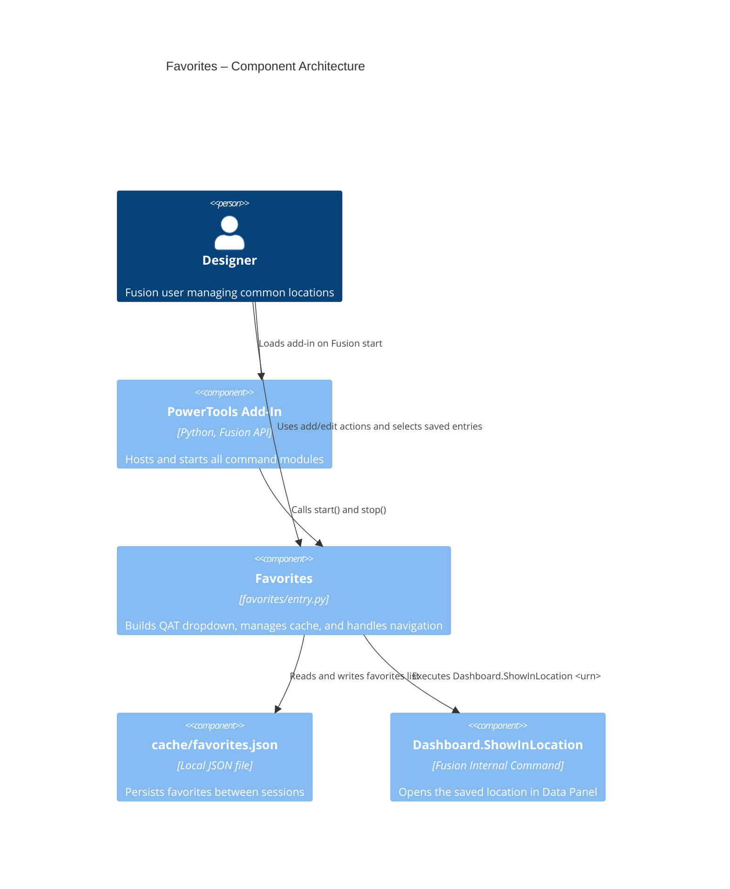

# Favorites

[Back to README](../README.md)

## Overview

The **Favorites** command adds a dropdown to the Fusion Quick Access Toolbar (QAT) so you can save and revisit frequently used document locations in Fusion Team Hub. It includes actions to add the current document location and edit the saved list.

Favorites are stored locally in the add-in cache file at `cache/favorites.json` and are rebuilt into the menu each time the add-in starts.

## Capabilities

| Capability | Details |
|---|---|
| Save active location | Adds the current saved document location using its lineage URN |
| Quick navigation | Creates one-click menu items that run `Dashboard.ShowInLocation <urn>` |
| Duplicate prevention | Skips adding entries when the same lineage URN is already saved |
| Edit favorites | Opens an edit dialog where one or more favorites can be selected and deleted |
| Persistent cache | Stores favorites in `cache/favorites.json` and restores them on startup |

## Prerequisites

- A Fusion document must be open.
- The document must be saved to Fusion cloud data.

## Notes

- Favorites are stored locally in `cache/favorites.json`.
- Favorites are resolved and rebuilt into command entries each time the add-in starts.
- Saved entries use lineage URNs so navigation remains stable across document versions.

## Access

Select **Favorites** from the **Quick Access Toolbar (QAT)**.

Inside the dropdown:

- **Favorite This Location** saves the active document location.
- **Edit Favorites** opens a dialog to remove selected entries.
- Each saved location appears as a command that navigates directly to that location in the Data Panel.

## Data model

Favorites are saved as JSON objects in `cache/favorites.json`.

```json
{
  "favorites": [
    {
      "name": "Document Name",
      "display": "Project > Folder > Subfolder",
      "urn": "urn:adsk.wipprod:dm.lineage:..."
    }
  ]
}
```

- `name`: document name shown in edit UI.
- `display`: folder lineage shown in the dropdown and edit table.
- `urn`: lineage URN used for reliable navigation.

## Architecture

The Favorites module creates one static dropdown control and a set of dynamic command definitions. The first two static actions are **Favorite This Location** and **Edit Favorites**. Below those actions, each favorite entry is added as a generated command that executes `Dashboard.ShowInLocation` for its saved URN.

### Command IDs

- Dropdown: `PTAT-favorites-dropdown`
- Add action: `PTAT-favorites-add`
- Edit action: `PTAT-favorites-edit`
- Dynamic favorite entries: `PTAT-fav-<index>`

### Execution flow

1. Add-in startup creates the Favorites dropdown on the QAT.
2. Startup registers static commands for add/edit and loads saved favorites from cache.
3. The menu is rebuilt with dynamic commands for each saved favorite.
4. **Favorite This Location** validates the active document is saved and writes a new favorite record if it is not a duplicate.
5. **Edit Favorites** stages changes in a dialog table and commits deletes only when the user confirms.
6. Selecting any saved favorite executes `Dashboard.ShowInLocation <urn>`.

### Component diagram



---

[Back to README](../README.md)

*Copyright © 2026 IMA LLC. All rights reserved.*
