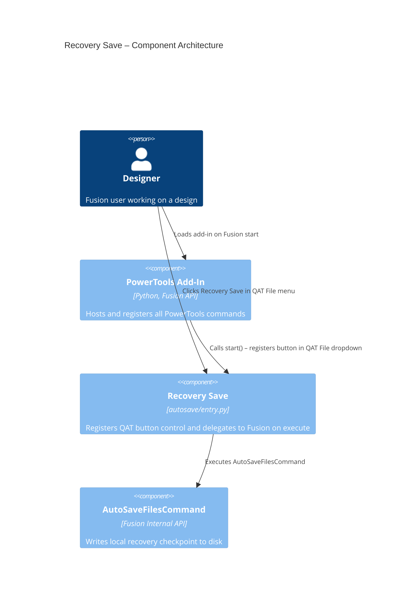

# Recovery Save

[Back to README](../README.md)

## Overview

The **Recovery Save** command adds a **Recovery Save** entry to the Fusion File dropdown on the Quick Access Toolbar (QAT). When you select it, Fusion writes a local recovery checkpoint for the active document to disk without creating a new cloud version. This protects work in progress between formal saves.

In team environments, each cloud save can trigger out-of-date notifications for collaborators. Recovery Save lets you checkpoint local work frequently without generating that version noise.

## Capabilities

| Capability | Details |
|---|---|
| Create a local recovery checkpoint | Writes a recovery file to disk for the active document |
| Avoid version increment | Does not create a new cloud version or notify collaborators |
| Quick access from the QAT | Available from the File dropdown on the Quick Access Toolbar |

## Prerequisites

- A Fusion design document must be open and active.

## Access

Select **Recovery Save** from the **File** dropdown on the **Quick Access Toolbar (QAT)**.

## Architecture

The Recovery Save command is a thin wrapper around Fusion's built-in `AutoSaveFilesCommand`. It registers a button control in the QAT File dropdown during add-in startup and delegates execution directly to the internal Fusion command on click.

### Command ID

`PTND-autoSave`

### Execution flow

1. The add-in registers the command definition and inserts a button after the **Save as Latest** control in the QAT File dropdown.
2. The user selects **Recovery Save**.
3. The `command_execute` handler retrieves the internal `AutoSaveFilesCommand` command definition from the Fusion UI.
4. `AutoSaveFilesCommand` is executed, writing the local recovery checkpoint.

### Component diagram

---

[Back to README](../README.md)

*Copyright © 2026 IMA LLC. All rights reserved.*
