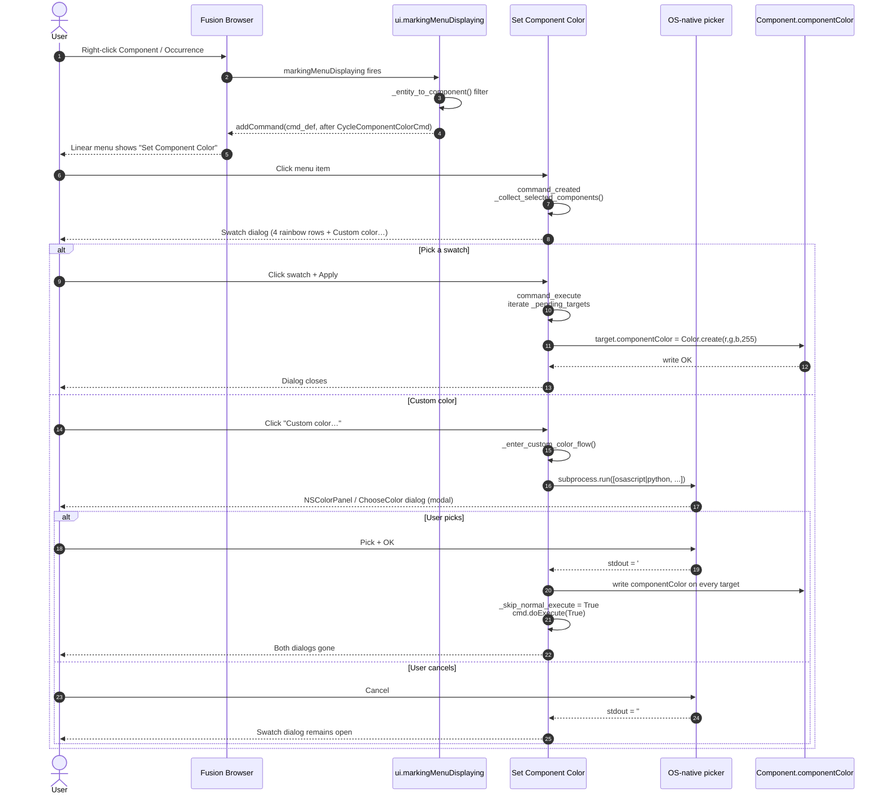
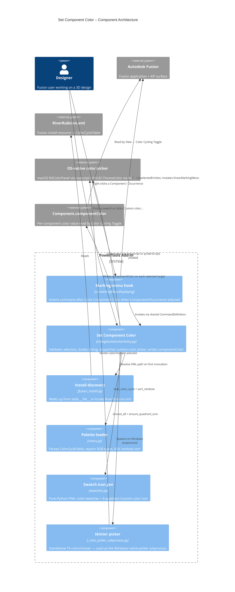

# Set Component Color

[Back to README](../README.md)

## Overview

The **Set Component Color** command writes Fusion's per-component `Component.componentColor` (the value read by **View → Color Cycling Toggle**) on every selected component. Two ways to pick a color:

- A **rainbow swatch palette** — 34 colors sourced live from Fusion's own `ColorCycleTable` (in `RiverRubicon.xml`, located dynamically inside the running install) and sorted by hue across four button rows.
- A **Custom color…** button that launches the OS-native color picker — `NSColorPanel` via `osascript` on macOS, `tkinter.colorchooser` running in a fresh Python subprocess on Windows.

The command is selection-driven: it operates on whichever Components or Occurrences are currently selected when invoked. It is exposed only from the **right-click context menu**; the toolbar registration is left in the source but commented out.

## Capabilities

| Capability | Details |
|---|---|
| Browser context-menu integration | Right-click any component node (including the root) → menu item appears immediately after Fusion's built-in **Cycle Component Color** |
| Selection-driven, multi-target | Iterates every Component or Occurrence in `ui.activeSelections`; dedupes by component id |
| `componentColor` only | Writes `Component.componentColor` exclusively; never touches `Appearance` |
| Rainbow swatch palette | 34 colors loaded from `RiverRubicon.xml`, HSV-sorted across four button rows; selection coordinates globally |
| OS-native custom picker | macOS: AppleScript `choose color` via `/usr/bin/osascript` (NSColorPanel). Windows: subprocess `tkinter.colorchooser` (Win32 ChooseColor) |
| No HTML / no PIL | Avoids in-process Tk (Cocoa run-loop conflict on macOS) and avoids PIL (not bundled with Fusion's Python) |

## Prerequisites

- A Fusion design must be open.
- One or more Components or Occurrences must be selected before invoking the command. The command shows an explanatory dialog and exits if the selection is empty.

## Notes

- **Path discovery**: `RiverRubicon.xml` is found by walking up from `adsk.__file__` until a known relative sub-path resolves. Tracks the current `webdeploy` hash automatically across Fusion updates.
- **XML repair**: a handful of shipped Fusion versions have malformed RGB values (missing decimal points, e.g. `"5412"` instead of `".5412"`). The loader repairs the obvious cases and silently drops anything it cannot interpret.
- **Rainbow sort key**: HSV-based with neutrals (`saturation < 0.18`) pushed to the end so the rainbow band stays clean.
- **Session-only state**: last-used color is held in a module-level variable; not persisted across Fusion restarts.
- **Visibility**: `componentColor` only renders when **View → Color Cycling Toggle** is enabled. With cycling off, the assignment is still stored and will appear next time cycling is on.
- **macOS Sequoia gotcha**: spawning Fusion's bundled `python3.14` shim from inside Fusion fails with `posix_spawn: Undefined error: 0` (Gatekeeper blocks the re-exec into `Python.app`). `osascript` is system-signed at a fixed path and is always allowed — that's why the macOS picker uses it.
- **Modal subprocess**: the picker process blocks Fusion's main thread until the user picks or cancels. Same UX as any modal dialog.

## Access

Right-click a Component or Occurrence in the browser (or any component-mode pick on the canvas) → **Set Component Color** appears in the context menu directly after **Cycle Component Color**.

## Architecture

### Command ID

`PTND-changeActiveColor`

### Module layout

```
commands/changeactivecolor/
  __init__.py
  entry.py                          # command lifecycle, menu hook, dialog, picker dispatch, apply
  fusion_install.py                 # locate RiverRubicon.xml relative to running install
  colors.py                         # parse ColorCycleTable, hex helpers, rainbow sort
  swatches.py                       # pure-Python PNG generator (solid + 4-quadrant)
  _color_picker_subprocess.py       # standalone tkinter.colorchooser script (Windows path)
```

### Execution flow

1. **`start()`** registers the `CommandDefinition` and subscribes a handler to `ui.markingMenuDisplaying`. The toolbar panel registration block is left in source but commented out.
2. **Marking-menu hook** (`_on_marking_menu_displaying`) runs on every right-click. It walks `args.selectedEntities`, calls `_entity_to_component()` to test for a Component or Occurrence, and — if any qualifies — calls `args.linearMarkingMenu.controls.addCommand(cmd_def, "CycleComponentColorCmd", isBefore=False)` to insert directly after Fusion's built-in cycle command. Failures are caught so the rest of the menu always renders.
3. **`command_created`** validates that `app.activeProduct` is a Design, calls `_collect_selected_components()` to gather unique target Components from `ui.activeSelections`, and aborts with an explanatory dialog if the selection is empty. On success it caches the rainbow-sorted swatches (one-time per session), builds the dialog (target description + four `ButtonRowCommandInput`s + custom-color button + colored preview), and subscribes `inputChanged`, `execute`, `destroy` handlers.
4. **`command_input_changed`** keeps single-selection coordinated across all four swatch rows (a click in one row clears `isSelected` on every item in the other three) and refreshes the preview chip. The Custom-color button trips `_enter_custom_color_flow`.
5. **`_enter_custom_color_flow`** invokes `_pick_color_native(initial_hex)`. On confirm, it iterates the captured targets and writes `componentColor`, then sets `_skip_normal_execute = True` and calls `cmd.doExecute(True)` to dismiss the swatch dialog. On cancel it returns; the swatch dialog stays open.
6. **`_pick_color_native`** dispatches by `sys.platform`:
   - **macOS** → `_pick_color_macos`: spawns `osascript` running `choose color default color {r16, g16, b16}`. Components are AppleScript's 0–65535 range; we scale to 0–255 on return.
   - **Other** → `_pick_color_subprocess_python`: locates Fusion's bundled Python via `sys.exec_prefix + /bin/python3.X`, spawns `_color_picker_subprocess.py` with the initial hex argument. The script runs `tkinter.colorchooser.askcolor` in its own clean run loop and prints the chosen hex.
7. **`command_execute`** checks `_skip_normal_execute` (set by the custom-color flow) and returns early if it's set. Otherwise it iterates `_pending_targets` and calls `_set_component_color(comp, rgb)` on each, where `rgb` comes from the selected swatch. Per-target success/failure is logged; total failure surfaces a deferred warning, partial failure surfaces a softer "succeeded on N, failed on X" message.
8. **`_set_component_color`** writes `target.componentColor = adsk.core.Color.create(r, g, b, 255)` and returns True/False. Wrapped in `hasattr` so older Fusion API versions degrade gracefully.
9. **`command_destroy`** clears `local_handlers`, `_pending_targets`, `_active_command`, and surfaces any deferred error via `messageBox`.

### User flow (sequence)



### Component diagram (C4)



---

[Back to README](../README.md)

*Copyright © 2026 IMA LLC. All rights reserved.*
