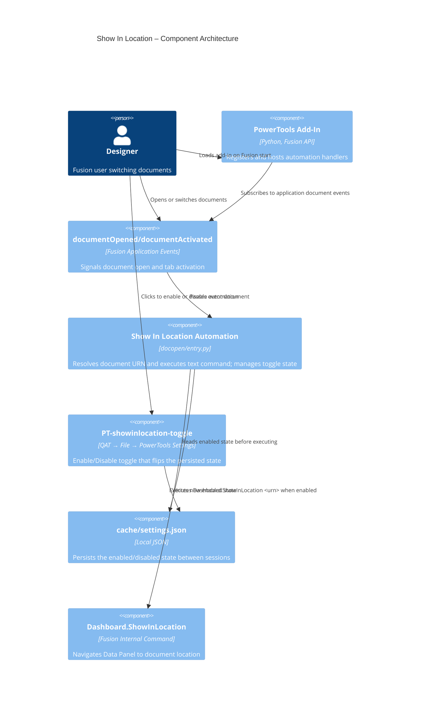

# Show In Location

[Back to README](../README.md)

## Overview

By default in Fusion, the Data Panel does not always track the document currently in focus. The **Show In Location** automation runs Fusion's built-in **Show In Location** text command whenever a document opens or when you switch to a different open document tab.

This keeps the Data Panel synchronized with the active document without any manual action.

## Capabilities

| Capability | Details |
|---|---|
| Automatic document tracking | Runs in the background whenever the add-in is loaded |
| Open-event sync | Triggers after each `documentOpened` event |
| Tab-switch sync | Triggers after each `documentActivated` event |
| Safe fallback behavior | Skips unsaved documents and logs errors without interrupting workflow |
| Enable / Disable toggle | A toggle command in the **PowerTools Settings** dropdown lets you turn the automation on or off without unloading the add-in |
| Persistent toggle state | The enabled/disabled state is saved to `cache/settings.json` and restored on next startup |

## Prerequisites

- The add-in must be loaded.
- The active document must be saved to Fusion cloud data to provide a valid `dataFile.id` URN.

## Notes

- Unsaved documents are skipped because they do not expose a valid cloud `dataFile` reference.
- The toggle label updates dynamically: it reads **Disable Show In Location** when the feature is active and **Enable Show In Location** when it is inactive.
- The enabled/disabled state persists between Fusion sessions via `cache/settings.json`.

## Access

This feature runs automatically in the background whenever the add-in is loaded.

To enable or disable the automation, select **Disable Show In Location** (or **Enable Show In Location**) from the **PowerTools Settings** sub-menu in the **File** dropdown on the **Quick Access Toolbar (QAT)**.

## Architecture

The Show In Location automation registers application-level event handlers on startup for `documentOpened` and `documentActivated`. Each event passes the event document to a shared helper that resolves the document URN and executes `Dashboard.ShowInLocation <urn>` through `app.executeTextCommand`.

### Command IDs

- Toggle button: `PT-showinlocation-toggle` (in the **PowerTools Settings** dropdown in the QAT File menu)

### Execution flow

1. The add-in starts and registers handlers for `app.documentOpened` and `app.documentActivated`.
2. The add-in installs a **Disable / Enable Show In Location** toggle button into the **PowerTools Settings** sub-menu in the QAT File dropdown.
3. The user opens a document or activates a different document tab.
4. The handler checks the persisted enabled state; if disabled, it exits immediately.
5. The handler validates that the event includes a document and a cloud `dataFile`.
6. The helper reads `doc.dataFile.id` and executes `Dashboard.ShowInLocation <urn>`.
7. The Data Panel selection updates to the current document location.

To toggle the automation, the user selects the toggle button in **PowerTools Settings**. The handler flips the state, saves it to `cache/settings.json`, and updates the button label.

### Component diagram

---

[Back to README](../README.md)

*Copyright © 2026 IMA LLC. All rights reserved.*
