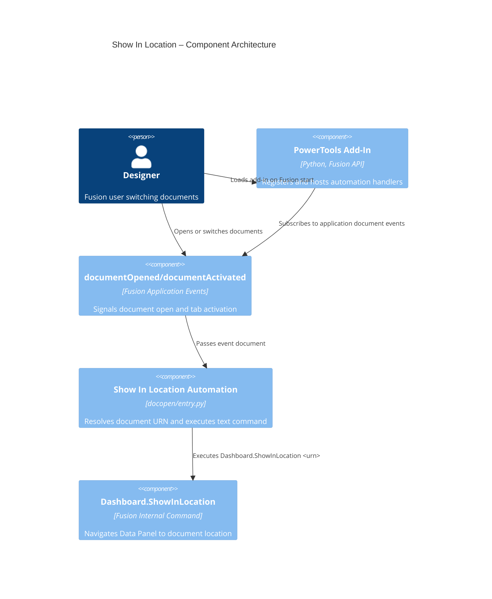

# Show In Location

[Back to README](../README.md)

## Overview

By default in Fusion, the Data Panel does not always track the document currently in focus. The **Show In Location** automation runs Fusion's built-in **Show In Location** text command whenever a document opens or when you switch to a different open document tab.

This keeps the Data Panel synchronized with the active document without any manual action.

## Capabilities

| Capability | Details |
|---|---|
| Automatic document tracking | Runs in the background with no button or dialog |
| Open-event sync | Triggers after each `documentOpened` event |
| Tab-switch sync | Triggers after each `documentActivated` event |
| Safe fallback behavior | Skips unsaved documents and logs errors without interrupting workflow |

## Prerequisites

- The add-in must be loaded.
- The active document must be saved to Fusion cloud data to provide a valid `dataFile.id` URN.

## Notes

- This feature is event-driven and does not create a toolbar button or dialog.
- Unsaved documents are skipped because they do not expose a valid cloud `dataFile` reference.

## Access

This feature runs automatically in the background whenever the add-in is loaded. No user interaction is required.

## Architecture

The Show In Location automation registers application-level event handlers on startup for `documentOpened` and `documentActivated`. Each event passes the event document to a shared helper that resolves the document URN and executes `Dashboard.ShowInLocation <urn>` through `app.executeTextCommand`.

### Command ID

N/A (event-driven automation with no UI command definition)

### Execution flow

1. The add-in starts and registers handlers for `app.documentOpened` and `app.documentActivated`.
2. The user opens a document or activates a different document tab.
3. The handler validates that the event includes a document and a cloud `dataFile`.
4. The helper reads `doc.dataFile.id` and executes `Dashboard.ShowInLocation <urn>`.
5. The Data Panel selection updates to the current document location.

### Component diagram

---

[Back to README](../README.md)

*Copyright © 2026 IMA LLC. All rights reserved.*
