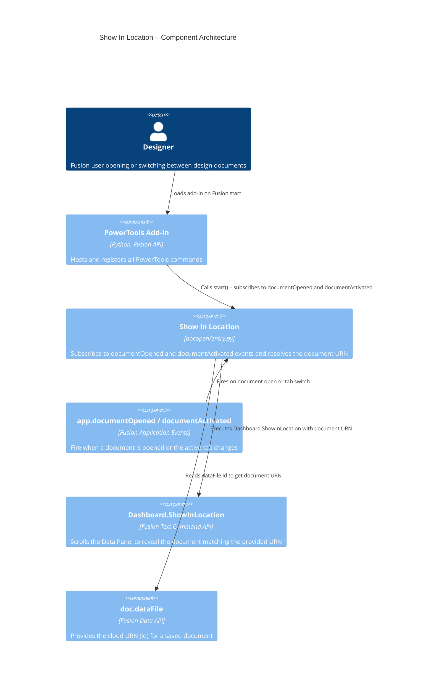

# Show In Location

[Back to README](../README.md)

## Overview

By default, the Fusion Data Panel does not update when you open a document or switch between document tabs. You must manually locate the active document in the Data Panel to see where it lives in your project hierarchy. The **Show In Location** feature removes this friction by automatically scrolling the Data Panel to reveal the active document whenever a design is opened or activated.

This feature runs silently in the background with no button, dialog, or user interaction required.

## Capabilities

| Capability | Details |
|---|---|
| Sync Data Panel on document open | Automatically reveals the opened document in the Data Panel when a design finishes loading |
| Sync Data Panel on tab switch | Automatically reveals the active document in the Data Panel when you switch between open document tabs |
| Silently ignore non-design documents | Drawings and other non-design document types are skipped without any error or notification |
| Silently handle unsaved documents | Documents that have not been saved to the cloud (no `dataFile`) are skipped without interrupting your workflow |
| Error isolation | Any unexpected errors are logged to the Fusion add-in log and do not surface to the user |

## Prerequisites

- The PowerTools add-in must be active.
- Documents must be saved to Fusion's cloud data to be located. Unsaved documents are silently skipped.

## Access

Show In Location runs automatically. No user action is required. It is active as long as the PowerTools add-in is loaded.

## Architecture

Unlike other PowerTools commands, Show In Location does not register a UI control. Instead, its `start()` function subscribes to two application-level Fusion events: `documentOpened` and `documentActivated`. Both events share a single internal handler that resolves the document's cloud URN from `dataFile.id` and passes it to Fusion's `Dashboard.ShowInLocation` text command.

### Module

`commands/docopen/entry.py`

### Trigger events

| Event | When it fires |
|---|---|
| `app.documentOpened` | After any document finishes loading |
| `app.documentActivated` | When the user switches to a different open document tab |

### Execution flow

1. During add-in startup, `start()` registers handlers for `app.documentOpened` and `app.documentActivated`.
2. Either event fires with an `adsk.core.DocumentEventArgs` argument containing the relevant document.
3. The shared `_show_in_location()` helper checks that the document and its `dataFile` are not `None`. If either is missing, the event is logged and skipped.
4. The document's cloud identifier is read from `dataFile.id` (a Fusion URN string).
5. `app.executeTextCommand("Dashboard.ShowInLocation <urn>")` is called, which scrolls the Data Panel to reveal the document.
6. Any exception is caught, logged, and suppressed so that the user's workflow is never interrupted.
7. During add-in shutdown, `stop()` clears `local_handlers`, which releases the event handler references and unsubscribes both events.

### Component diagram

---

[Back to README](../README.md)

*Copyright © 2026 IMA LLC. All rights reserved.*
